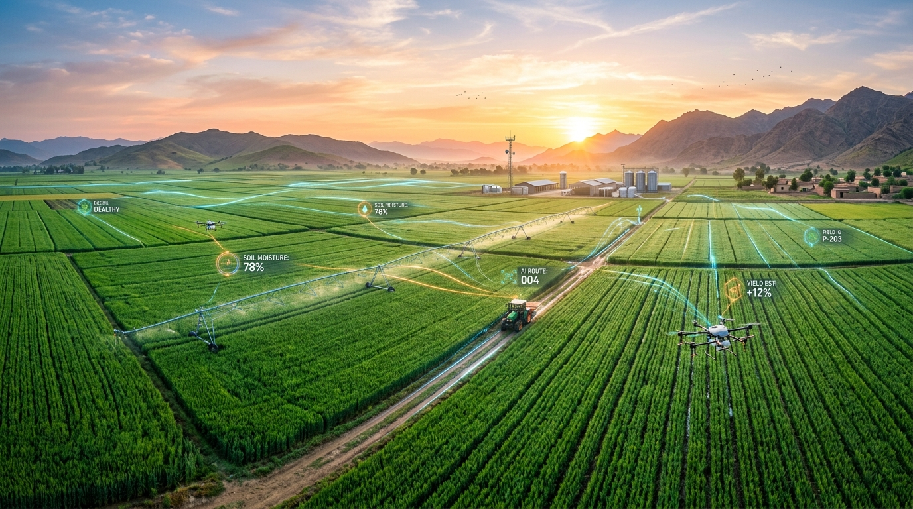

# FasalRehbar AI (فصل رہبر) — AI Crop Health & Agriculture Assistant

<div align="center">
  
  <br/><br/>
  <p><strong>Precision AI-powered foliar disease diagnosis, multi-stage neural crop identification, and evidence-grounded 7-day agronomic recovery advisory tailored for Pakistani agriculture.</strong></p>
  
  <p>
    <a href="#key-features">Key Features</a> •
    <a href="#architecture">Architecture</a> •
    <a href="#supported-crops">Supported Crops</a> •
    <a href="#quick-start">Quick Start</a> •
    <a href="#bilingual-support">Bilingual Support</a> •
    <a href="#license">License</a>
  </p>
</div>

---

## 🌾 Overview

**FasalRehbar AI** is a production-ready, full-stack precision agriculture assistant developed to empower farmers, agronomists, and agricultural researchers across Pakistan. By combining high-speed neural vision models with grounded research standards (PARC, UAF, and FAO), FasalRehbar AI provides instantaneous, evidence-backed foliar health diagnosis and practical recovery guidance.

---

## ⚡ Key Features

- **🌱 3-Stage Intelligent Diagnostic Pipeline:**
  1. **Stage 1 (Crop Classification):** EfficientNet-B0 classifier with multi-model joint candidate verification over target crops.
  2. **Stage 2 (Disease Detection & Localization):** YOLOv8s-cls deep neural network diagnosing 29 distinct pathogen classes with visual symptom heatmap overlays.
  3. **Stage 3 (Evidence-Grounded Advisory):** Structured, actionable 7-day containment roadmap, immediate cultural & biological measures, and balanced irrigation protocols.
- **🌐 Bilingual & True RTL Support (English ↔ اردو):**
  - Seamless instant toggle between English and authentic Pakistani Urdu Nastaliq typography.
  - Full bidirectional layout flipping (`dir="rtl"` / `dir="ltr"`).
  - Dual-mode AI recommendations (English + Urdu translation in English mode; 100% Urdu in Urdu mode).
- **📊 Interactive Farmer Dashboard & Analytics:**
  - Real-time statistics on total scans, healthy crop ratios, and disease breakdown charts (Chart.js).
  - Complete historical scan archive with image previews, severity badges, and deletion management.
- **🛡️ Security & Privacy:**
  - Zero hardcoded secrets, strict environment variable segregation (`.env`), clean CSRF protection, and user data isolation.

---

## 🧅 Supported Crops & Diagnostic Scope

| Crop | Urdu Name | Covered Foliar Diseases |
| :--- | :--- | :--- |
| **🧅 Onion** | پیاز | Purple Blotch, Downy Mildew, Stemphylium Leaf Blight, Rust, Botrytis Leaf Blight, Healthy |
| **🥭 Mango** | آم | Anthracnose, Bacterial Canker, Cutting Weevil, Die Back, Gall Midge, Powdery Mildew, Sooty Mould, Healthy |
| **🌱 Sugarcane** | گنا | Red Rot ("cane cancer"), Bacterial Blight, Rust, Mosaic Virus, Yellow Leaf Disease, Healthy |

---

## 🏗️ Architecture & Technology Stack

- **Backend:** Python 3.10+, Django 5.x
- **Machine Learning & Deep Neural Networks:** PyTorch, Ultralytics YOLOv8, Timm (EfficientNet-B0), Albumentations
- **Translation & i18n:** GNU gettext, `polib` (pure UTF-8 catalog compilation)
- **Frontend:** Responsive HTML5, Modern Vanilla CSS Design System, Bootstrap 5.3, FontAwesome 6, Chart.js
- **Database:** SQLite (default) / PostgreSQL compatible

---

## 🚀 Quick Start Guide

### 1. Clone the Repository
```bash
git clone https://github.com/Haseeb804/FasalRehbar-AI.git
cd FasalRehbar-AI
```

### 2. Set Up Virtual Environment
```bash
python -m venv venv
# On Windows:
.\venv\Scripts\activate
# On Linux/macOS:
source venv/bin/activate
```

### 3. Install Dependencies
```bash
pip install -r requirements.txt
```

### 4. Configure Environment Variables
Copy `.env.example` to `.env`:
```bash
cp .env.example .env
```
Update your `.env` with your settings.

### 5. Compile Translation Catalogs
```bash
python scripts/compile_po.py
```

### 6. Apply Database Migrations & Run Server
```bash
python manage.py migrate
python manage.py runserver
```
Visit `http://127.0.0.1:8000/` in your browser.

---

## 🌐 Bilingual Support (English / اردو)

FasalRehbar AI comes with 350+ compiled translation entries in `locale/ur/LC_MESSAGES/django.mo`. To compile new translations after updating `django.po`:
```bash
python scripts/compile_po.py
```

---

## 📄 License

This project is licensed under the MIT License — see the [LICENSE](LICENSE) file for details.
